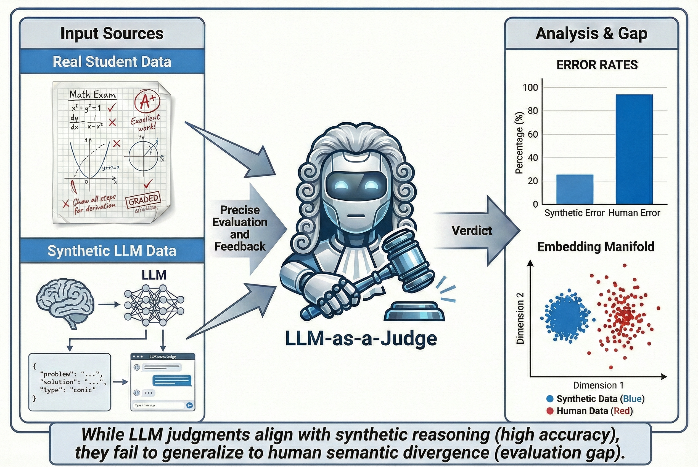

  

    <h1>Yiteng (Richard) Mao</h1>
    
<strong>Undergraduate @ UW-Madison CS</strong>

    
<em>Methodology-Driven AI Researcher</em>

    

      <a href="./assets/CV_Yiteng_Mao.pdf">CV (PDF)</a>
      <a href="mailto:mao85@wisc.edu">Email</a>
      <a href="https://github.com/RicharMd">GitHub</a>
      <a href="https://scholar.google.com/citations?user=xqWzuW0AAAAJ&hl=en">Google Scholar</a>
    

  

  

## Research Vision

I am interested in reliable learning signals for large language models, especially through **RLHF/RLVF**, **reward modeling**, and **Internalizing Consciousness in LLMs**.

My recent work started from a question about **hallucination** and evaluation failure, and has gradually pushed me toward post-training as a practical entry point: how **RLHF/RLVF** pipelines handle real, high-variance human reasoning rather than only cleaner model-generated distributions.

At the same time, I remain deeply interested in **hallucination awareness**, **internalized awareness**, and the deeper question of how models come to internalize reliable reasoning rather than merely imitate it.

## Ongoing Research

<h3>RealMath-Eval: Benchmarking LLM Judges on Authentic Student Reasoning</h3>

Independent Research | Advisor: Prof. Hongyuan Zha | <a href="https://arxiv.org/abs/2606.10254">arXiv:2606.10254</a>

  

    

      <a href="https://arxiv.org/abs/2606.10254">Paper</a>
      <a href="https://github.com/RicharMd/RealMath-Eval">Code</a>
      <a href="https://huggingface.co/datasets/RicharMd/RealMath-Eval">Data</a>
    

    <ul class="paper-points">
      <li><strong>The Problem</strong>: SOTA LLM Judges are much more reliable on synthetic model-generated reasoning than on authentic human reasoning, revealing an "Evaluation Gap" in how current evaluators handle real student errors.</li>
      <li><strong>The Benchmark</strong>: Built <strong>RealMath-Eval</strong> from <strong>300+ authentic high-school math assessments</strong>, with <strong>224</strong> expert-annotated samples and fine-grained evaluation labels.</li>
      <li><strong>The Insight</strong>: This project pushed me to think more seriously about whether human reasoning errors are effectively OOD for current judge and reward-model pipelines.</li>
      <li><strong>Current Status</strong>: Submitted to <strong>COLM</strong>.</li>
    </ul>
  

  

    
    
Figure 1. Overview of RealMath-Eval and the Evaluation Gap between authentic student reasoning and synthetic LLM solutions.

  

<h3>Lean4Eval: Formal Reasoning for LLM Evaluation</h3>

Research Assistant | Advisor: Prof. Hongyuan Zha

<ul class="compact-list">
  <li>Explored the role of <strong>Lean4-style formal reasoning</strong> in LLM evaluation pipelines.</li>
  <li>Built unified evaluation workflows across multiple datasets and used the project to develop a stronger interest in the boundary between symbolic rigor and empirical reliability.</li>
</ul>

## Selected Projects

<h3><a href="https://github.com/RicharMd/Algo-Trading-Transformer-RL">Algorithmic Trading Agent: RL &amp; Transformer Integration</a></h3>

Kaggle Competition |

<ul class="compact-list">
  <li><strong>SFT-GRPO Pipeline</strong>: Finetuned <strong>N-HiTS</strong> (MLP) for signal generation, followed by <strong>GRPO</strong> for portfolio allocation.</li>
  <li><strong>"Rotten Apple" Mechanism</strong>: Implemented rolling OOS signal generation to prevent look-ahead bias in RL training.</li>
</ul>

<h3><a href="https://github.com/RicharMd/High-Perf-Numerical-Image-Deblurring">High-Performance Numerical Image Deblurring</a></h3>

Individual Project | Advisor: Prof. Andre Milzarek

<ul class="compact-list">
  <li><strong>HPC Optimization</strong>: Implemented JIT-compiled (Numba) <strong>Givens Rotation QR</strong>, outperforming LAPACK by <strong>6x</strong> on banded matrices.</li>
  <li><strong>Math Foundation</strong>: Bridges the gap between Linear Algebra theory ($Ax=b$) and high-performance computing.</li>
</ul>

<h3><a href="https://github.com/RicharMd/Smart-Cafeteria-System">Smart Cafeteria System (Full-Stack + AI)</a></h3>

Group Leader | Tech: Python, MySQL (4NF), LLM-Agent

<ul class="compact-list">
  <li>Designed a 4NF-compliant database schema and integrated an <strong>LLM-based Query Agent</strong> for natural language SQL generation.</li>
</ul>

## Education

<ul class="edu-list">
  <li><strong>University of Wisconsin-Madison</strong> (2026 Spring - Present) B.S. in Computer Science</li>
  <li><strong>The Chinese University of Hong Kong, Shenzhen</strong> (2023 - 2025)</li>
</ul>

Last updated: June 2026

